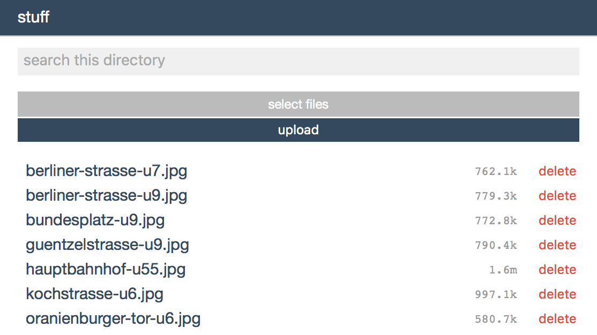

# *casket*

***casket* is an HTTP server** that supports `GET`, `POST` and `DELETE` requests. It can respond in HTML, JSON and plain text format, **the HTML-version being a file management UI**.

It also supports file search [using Spotlight](https://github.com/derhuerst/node-spotlight), and it can stream any audio file to an AirPlay receiver.



[](https://www.npmjs.com/package/casket)
[](https://david-dm.org/derhuerst/casket)
[](https://david-dm.org/derhuerst/casket#info=devDependencies)

[](https://github.com/sponsors/derhuerst)
[](https://twitter.com/derhuerst)


## Installing

```shell
npm install -g casket
```


## Usage

```
Usage:
	casket [--name my-little-server] [--dir ~/path/to/dir] [--airplay my-apple-tv.local]

Options:
    --name      -n  The name of the server, as shown in the GUI.
    --dir       -d  The directory to serve, default is the current directory.
    --readonly  -r  Do not allow deletion of files & uploads.
    --no-delete -w  Do not allow deletion of files.
    --no-upload -u  Do not allow file upload.
    --port      -p  Default is 8000.
    --airplay   -a  An AirPlay receiver to stream audio to.
```


## Contributing

If you **have a question**, **found a bug** or want to **propose a feature**, have a look at [the issues page](https://github.com/derhuerst/casket/issues).
